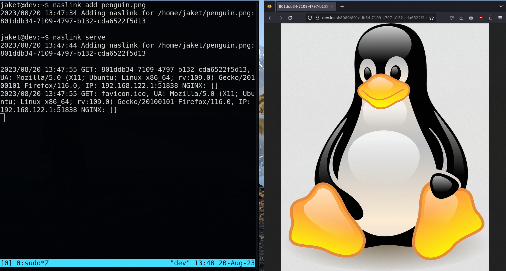

## naslink


Simple Go program for serving files over HTTP with a unique UUID link.

```
Usage: naslink <command> [options]
  serve [host] [port]
    - start serving the naslinks over http (default 0.0.0.0 over port 8080)
  add [filepath1 filepath2 ... filepathN]
    - adds the specified files to serve as a naslink
  delete [filepath1 filepath2 ... filepathN]
    - removes the naslink for the file specified
  list, ls
    - show all of the existing naslinks
  clean
    - removes all invalid naslinks
```


